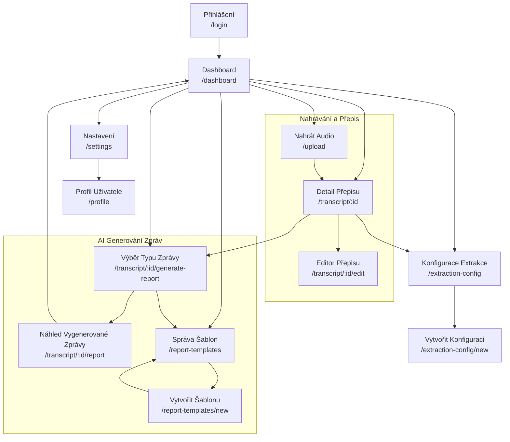

# User Flow — MediAI MVP

```mermaid
graph TD
  %% Autentizace
  Login["Přihlášení<br/>/login"]

  %% Primární stránky
  Dashboard["Dashboard<br/>/dashboard"]

  %% Core Business Features - Nahrávání a přepis
  subgraph "Nahrávání a Přepis"
    Upload["Nahrát Audio<br/>/upload"]
    TranscriptDetail["Detail Přepisu<br/>/transcript/:id"]
    TranscriptEditor["Editor Přepisu<br/>/transcript/:id/edit"]
  end

  %% [NOVÉ] AI Generování zpráv
  subgraph "AI Generování Zpráv"
    ReportTypeSelection["Výběr Typu Zprávy<br/>/transcript/:id/generate-report"]
    ReportPreview["Náhled Vygenerované Zprávy<br/>/transcript/:id/report"]
    ReportTemplates["Správa Šablon<br/>/report-templates"]
    CreateTemplate["Vytvořit Šablonu<br/>/report-templates/new"]
  end

  %% Konfigurace extrakce
  ExtractionConfig["Konfigurace Extrakce<br/>/extraction-config"]
  ExtractionCreate["Vytvořit Konfiguraci<br/>/extraction-config/new"]

  %% Nastavení a profil
  Settings["Nastavení<br/>/settings"]
  Profile["Profil Uživatele<br/>/profile"]

  %% Primární navigace
  Login --> Dashboard
  Dashboard --> Upload
  Dashboard --> TranscriptDetail
  Dashboard --> ExtractionConfig
  Dashboard --> Settings
  Dashboard --> ReportTemplates

  %% Workflow nahrávání a editace
  Upload --> TranscriptDetail
  TranscriptDetail --> TranscriptEditor

  %% [NOVÉ] Report generation workflow
  TranscriptDetail --> ReportTypeSelection
  Dashboard --> ReportTypeSelection
  ReportTypeSelection --> ReportPreview
  ReportPreview --> Dashboard

  %% [NOVÉ] Template management workflow
  ReportTypeSelection --> ReportTemplates
  ReportTemplates --> CreateTemplate
  CreateTemplate --> ReportTemplates

  %% Konfigurace extrakce
  ExtractionConfig --> ExtractionCreate

  %% Cross-page navigace
  TranscriptDetail --> ExtractionConfig
  Settings --> Profile
```
