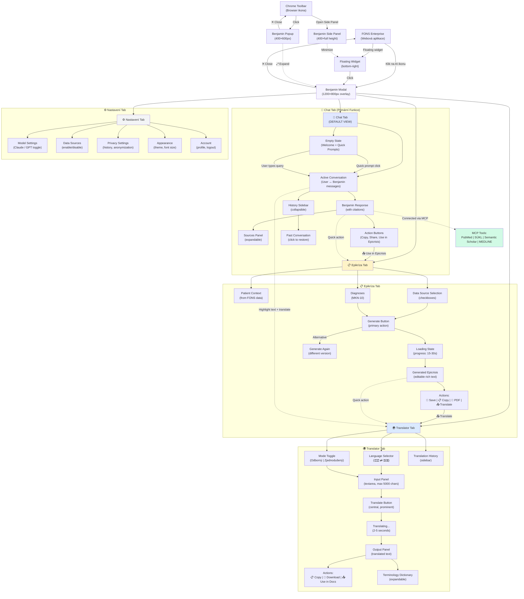

# User Flow — Benjamin AI Klinický Asistent

**Verze:** 2.0 (Aktualizováno pro modal architekturu)
**Platforma:** Web (Modal + Chrome Extension)
**Produkt:** Benjamin - AI asistent pro české lékaře

---

## Architektura

```
BENJAMIN = Celá AI platforma
├─ 💬 Chat (HLAVNÍ - default view)
├─ 📋 Epikríza (tab)
├─ 🌍 Translator (tab)
└─ ⚙️ Nastavení (tab)

Formáty:
- 🪟 Modální okno (1200×800px) nad FONS Enterprise
- 🔌 Chrome Extension (popup 400×600px / side panel)
- 🔲 Floating widget na FONS stránce
```

---

## User Flow Diagram



---

## Entry Points (Vstupní Body)

### 1. FONS Enterprise (Web App)
**Trigger:** Kliknutí na AI ikonu v FONS interface
**Result:** Otevření Benjamin modal (1200×800px overlay)
**Default View:** Chat tab (empty state)

**Alternative:** Floating widget (bottom-right corner)
- FAB (56×56px) s Benjamin logem
- Click → Opens modal
- Long press → Quick action menu

---

### 2. Chrome Extension (Toolbar)
**Trigger:** Kliknutí na Benjamin ikonu v Chrome toolbar
**Result:** Benjamin popup (400×600px)
**Default View:** Chat tab (compact layout)

**Alternative:** Side Panel
- Right-click → "Open in Side Panel"
- Result: 400×full height panel, persistent across tabs

---

## Primary Flows (Hlavní Uživatelské Toky)

### Flow A: Quick Clinical Query (Chat)

**Scenario:** Dr. Nováková potřebuje rychle ověřit interakce léků během vyšetření

```
1. Open Benjamin modal (click AI icon in FONS)
2. See empty state → Select quick prompt "💊 Interakce léků"
   OR type: "Interakce warfarinu se SSRI?"
3. Benjamin generates response (3-5 seconds)
   - Display: Structured answer with inline citations [1], [2]
   - Sources panel: PubMed, SÚKL databáze
4. Click "📚 Zobrazit zdroje" → Expand citations
5. Click "📋 Kopírovat" → Copy to clipboard
6. Close modal → Return to FONS patient record
```

**Time:** ~30 sekund (vs. 10+ minut manual search)

---

### Flow B: Generate Epicrisis (Epikríza Tab)

**Scenario:** Dr. Svoboda dokončuje hospitalizaci, potřebuje vygenerovat epikrízu

```
1. Open Benjamin modal (from FONS patient page)
2. Switch to "📋 Epikríza" tab
3. See patient context (auto-loaded from FONS):
   - Name, age, admission/discharge dates
4. Review data sources (all checked by default):
   ☑️ Dekurzy (12 záznamů)
   ☑️ Lab výsledky (23)
   ☑️ Vyšetření (8)
   ☑️ Medikace (15)
5. Click "🤖 Generovat Epikrízu"
6. Wait ~20 seconds (progress indicator)
7. Review generated epicrisis (structured, compliant with § 21)
8. Edit if needed (inline editing)
9. Click "💾 Uložit do FONS Enterprise"
10. Success → Epicrisis saved to patient record
```

**Time:** ~2 minuty (vs. 20+ minut manual writing)

---

### Flow C: Translate Medical Text (Translator Tab)

**Scenario:** Dr. Kučera potřebuje přeložit SPC léku pro cizince

```
1. Open Benjamin modal
2. Switch to "🌍 Translator" tab
3. Select: 🇨🇿 → 🇬🇧 (language pair)
4. Select: "Odborný" režim (keep medical terminology)
5. Paste text into input panel (or upload .docx)
6. Click "🌍 Přeložit" (central button)
7. Wait ~3 seconds
8. Review translated text in output panel
9. Click "📋 Kopírovat" OR "📄 Stáhnout jako .docx"
10. Optional: View terminology dictionary for key terms
```

**Time:** ~1 minuta (vs. 10+ minut manual translation)

---

## Cross-Feature Integrations (Propojení Funkcí)

### 1. Chat → Epikríza
**Trigger:** "📤 Použít v epikríze" button pod Benjamin response
**Action:**
- Switch to Epikríza tab
- Pre-fill relevant data from chat response
**Use Case:** Lékař se zeptá na guidelines, pak chce použít odpověď v epikríze

---

### 2. Epikríza → Translator
**Trigger:** "📤 Přeložit do EN" button v epicrisis actions
**Action:**
- Switch to Translator tab
- Pre-fill input with epicrisis content
- Auto-set: 🇨🇿 → 🇬🇧, Odborný režim
**Use Case:** Zahraniční pacient potřebuje anglickou propouštěcí zprávu

---

### 3. Chat → Translator
**Trigger:** Highlight text in Benjamin response + right-click → "Přeložit"
**Action:**
- Switch to Translator tab
- Pre-fill selected text
**Use Case:** Rychlý překlad konkrétního termínu nebo věty

---

## Navigation Patterns (Navigační Vzory)

### Tab Switching
**Method:** Horizontal tab bar (top of modal)
- 💬 Chat | 📋 Epikríza | 🌍 Translator | ⚙️ Nastavení
**Keyboard:** `Cmd/Ctrl + 1/2/3/4`
**State:** Tabs remember their state (conversation persists when switching)

### History Access
**Chat History:** Right sidebar (collapsible)
- Last 10 conversations
- Click to restore
**Epicrisis History:** Within Epikríza tab, "📜 Historie" button
**Translation History:** Within Translator tab, right sidebar

### Modal Controls
- **Close:** ✕ button (top-right) OR `Esc` key → Returns to FONS
- **Minimize:** (Chrome Extension only) → Collapses to floating widget
- **Expand:** (Extension popup) → ⤢ button → Opens full modal in new tab

---

## Chrome Extension Specific Flows

### Flow D: Extension Popup Quick Query

```
1. Click Benjamin icon in Chrome toolbar
2. Popup opens (400×600px, compact layout)
3. Type query in input field
4. Get response (same as modal, but compact view)
5. Optional: Click "⤢ Expand" → Opens full modal in new tab
6. Close popup OR keep open while browsing
```

### Flow E: Side Panel Persistent Assistant

```
1. Right-click Benjamin icon → "Open in Side Panel"
2. Side panel opens (400px width, full height)
3. Persistent across tabs (stays open while browsing)
4. Full chat history visible (longer scrollback)
5. Dock on right side of browser
6. Minimize to floating button when not needed
```

### Flow F: FONS Page Integration (Content Script)

```
1. Visit FONS Enterprise page
2. Benjamin floating widget appears (bottom-right)
3. Click widget → Opens modal overlay (800×600px on FONS page)
4. Context-aware: Auto-detects patient data from FONS page
5. Pre-fills patient info in Epikríza tab
6. Seamless integration with FONS workflow
```

---

## Error & Edge Cases (Chybové Stavy)

### Flow G: No MCP Connection

```
1. User sends query in Chat
2. Benjamin detects MCP tools offline
3. Display error banner: "⚠️ Některé zdroje nedostupné (PubMed offline)"
4. Options:
   - "Zkusit znovu" → Retry connection
   - "Pokračovat s cache" → Use cached data (degraded mode)
5. Response generated with warning: "⚠️ Odpověď z cache, nemusí být aktuální"
```

### Flow H: Incomplete Epicrisis Data

```
1. User clicks "Generovat Epikrízu"
2. System checks required data
3. Missing: Hlavní diagnóza
4. Display error: "⚠️ Nelze vygenerovat - chybí povinné údaje"
5. CTA: "➡️ Doplnit v FONS Enterprise" (deep link to FONS diagnosis form)
6. User completes data in FONS
7. Returns to Benjamin → Data now available → Generate succeeds
```

---

## Success Metrics per Flow

**Chat Flow:**
- Time to answer: <5 seconds (p95)
- User satisfaction: NPS >50
- Sources clicked: >30% users expand citations

**Epicrisis Flow:**
- Time saved: 18 minutes average (20min → 2min)
- Acceptance rate: >90% (minimal edits needed)
- Compliance: 100% match § 21 requirements

**Translator Flow:**
- Translation time: <5 seconds
- Accuracy: >95% (user rating)
- Terminology lookup: >40% users check dictionary

---

## Future Enhancements (Post-MVP)

- **Flow I:** Voice input (speech-to-text) v Chat tabu
- **Flow J:** Image upload (lab results OCR) v Chat tabu
- **Flow K:** Multi-turn conversations s context awareness
- **Flow L:** Collaboration mode (share conversation with colleagues)
- **Flow M:** Offline mode (cached responses, sync when online)

---

**Legenda:**
- `→` Přímá akce/krok
- `-.->` Cross-feature integrace
- `|` Nebo/alternativa
- `☑️` Checkbox/volba
